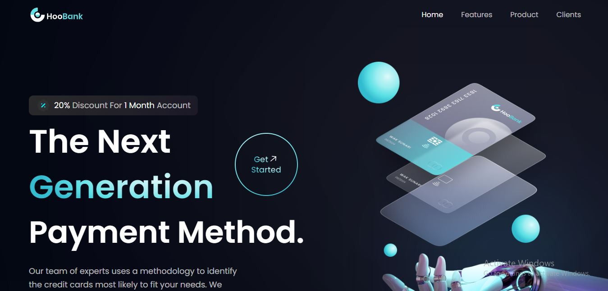
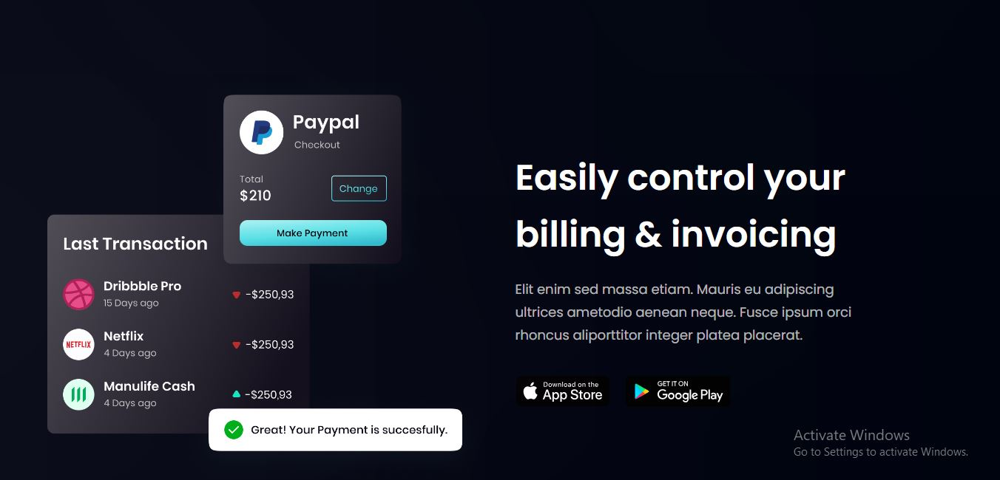
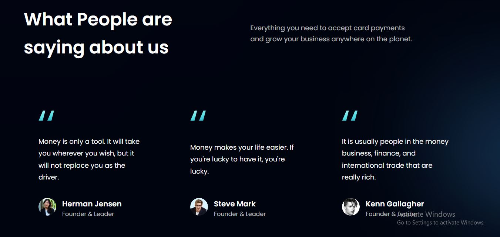
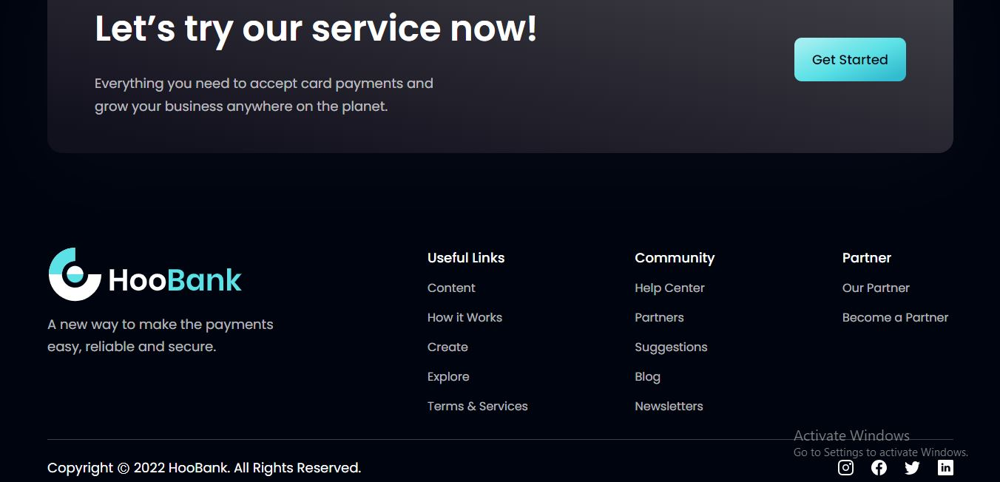

# Hoobank Project


Welcome to Hoobank Landing Page, a stylish and modern web application built using React.js and SCSS. Hoobank Landing Page provides an attractive landing page for your online banking platform, showcasing your services and attracting potential customers.

## Screenshots 









## Links
* Solution Link [Here](https://github.com/kizitech/HooBank)
* Live Link [Here]()

## Table of Contents

1. [Introduction](#introduction)
2. [Features](#features)
3. [Installation](#installation)
4. [Usage](#usage)
5. [Technologies Used](#technologies-used)
6. [Contributing](#contributing)
6. [Credits](#credits)
6. [Author](#author)
7. [License](#license)

## Introduction

Hoobank Landing Page is a beautifully designed React.js-based landing page for an online banking platform. It highlights the key features and benefits of your banking services, encouraging visitors to explore further and take action.

## Features

Hoobank comes with a range of features, including:

Hoobank Landing Page offers the following features:

- Modern and Clean Design: Present your banking platform with a professional and visually appealing look.
- Responsive Layout: Ensures a seamless experience across various devices and screen sizes. Mobile-friendly for access on-the-go.
- Call-to-Action Sections: Strategically placed call-to-action (CTA) sections to drive user engagement.
- Service Highlights: Showcase the main services and features of your banking platform.
- Contact Us: Include a Useful Links in the footer to enable visitors to get in touch easily.

## Installation

To set up Hoobank locally on your machine, follow these steps:

1. Clone the repository:

```bash
git clone https://github.com/kizitech/HooBank.git
cd Hoobank
```

2. Install dependencies:

```bash
npm create vite@latest
```

## Usage

To run Hoobank on your local development server, use the following command:

```bash
npm run dev
```

The application will be accessible at `http://localhost:3000/` in your web browser.

## Technologies Used

Hoobank is built using the following technologies:

- Vite: A fast build tool for modern web development, providing a quick development server and optimized builds.
- React js: A popular JavaScript library for building user interfaces.
- SCSS: A CSS preprocessor that adds features and flexibility to the styling

## Contributing

We welcome contributions from the community to make Hoobank even better. If you'd like to contribute, please follow these steps:

1. Fork the repository.
2. Create a new branch for your feature: `git checkout -b feature-name`
3. Implement your changes and commit them: `git commit -m "Description of your changes"`
4. Push your changes to your forked repository: `git push origin feature-name`
5. Open a pull request to the main repository.


## Credits

- The website template was created by [Ohani Kizito](https://github.com/kizitech).


## Author

- LinkedIn - [Ohani Kizito](https://www.linkedin.com/in/ohanikizito/)
- Twitter - [Ohani_Kizito](https://www.twitter.com/Ohani_Kizito)

## License

Hoobank is licensed under the [MIT License](LICENSE).

---

Thank you for choosing Hoobank! We hope you find it helpful for managing your finances efficiently. If you encounter any issues or have any feedback, please don't hesitate to reach out to us.

Happy banking! 🏦