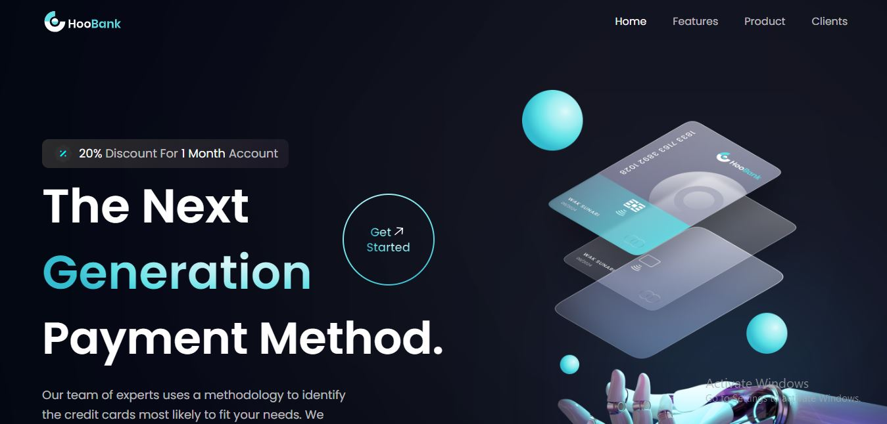
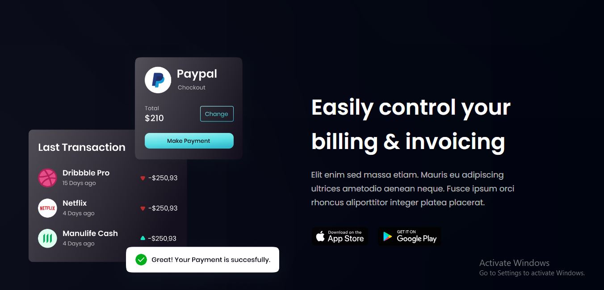
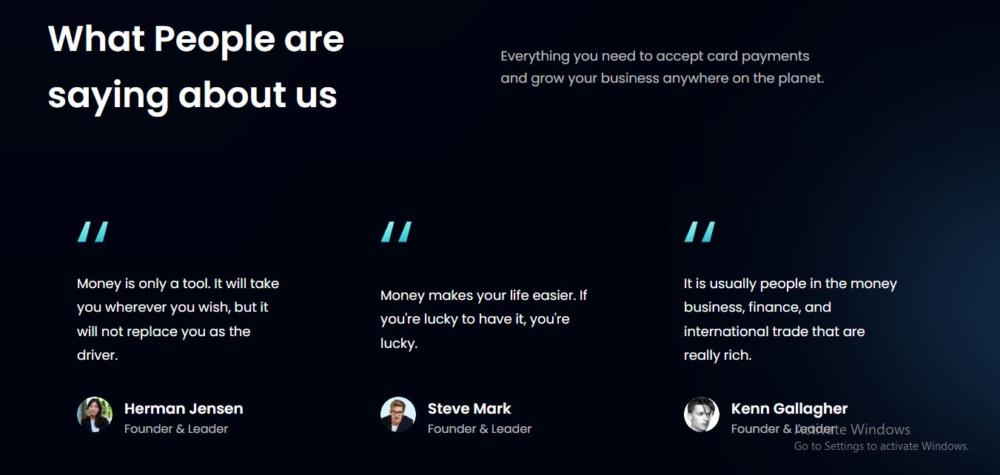
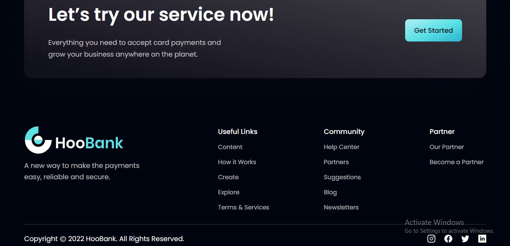

# HooBank

A modern, responsive landing page for a digital banking product, built with React and SCSS.

## Live Demo
[hoobank live link](https://hoobankdouble.vercel.app/)

## Tech Stack
    

## What it does
- Clean banking landing page with a strong hero section
- Responsive layout for desktop and mobile
- Feature sections, testimonials, billing, and CTA blocks
- Smooth, polished UI focused on trust and clarity

## Screenshots 








## Getting Started

### 1. Clone the repo
```bash
git clone https://github.com/kizitech/HooBank.git
cd HooBank
```

### 2. Install dependencies
```bash
npm install
```

### 3. Run the app
```bash
npm run dev
```

The app runs locally at `http://localhost:5173`.

## Links
- GitHub: https://github.com/kizitech/HooBank
- LinkedIn: https://www.linkedin.com/in/ohanikizito/
- Twitter: https://x.com/Ohani_Kizito
