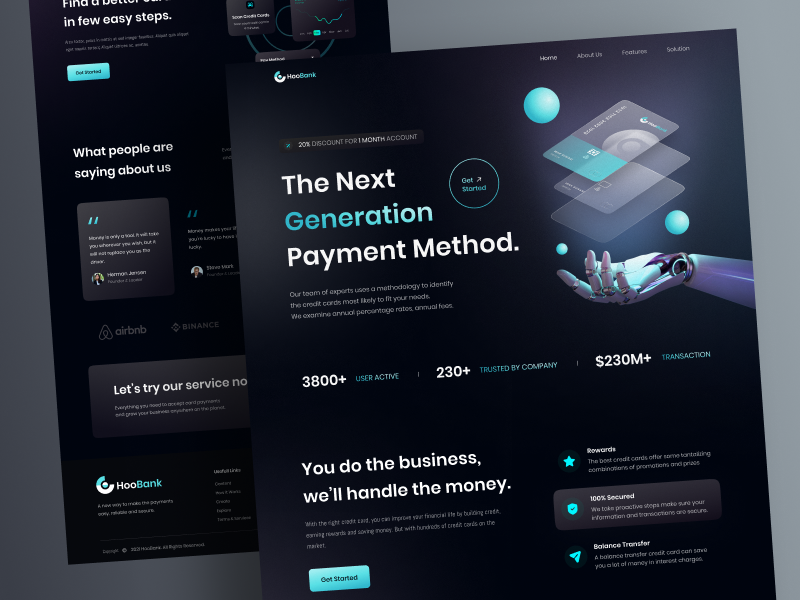

# HooBank

A modern, responsive banking landing page UI built from the HooBank community design, with a polished visual system and strong mobile support.

## Live Demo
[View the live site](https://hoobankdouble.vercel.app/)

## Figma Design
[View the design](https://www.figma.com/design/v0NCuttI2kd32sahpx9aaC/HooBank--Community-?node-id=0-1&p=f&t=OwbKEGVFqfTEGysQ-0)

## Tech Stack
    

## What it does
- Clean banking landing page with a strong hero section
- Responsive layout across desktop and mobile
- Feature blocks, billing section, testimonials, and CTA areas
- Smooth, polished UI focused on trust, clarity, and conversion

## Screenshots



## Getting Started

### 1. Clone the repo
```bash
git clone https://github.com/kizitech/HooBank.git
cd HooBank
```

### 2. Install dependencies
```bash
npm install
```

### 3. Run the app
```bash
npm run dev
```

The app runs locally at `http://localhost:5173`.

## Links
- GitHub: https://github.com/kizitech/HooBank
- LinkedIn: https://www.linkedin.com/in/ohanikizito/
- Twitter: https://x.com/Ohani_Kizito
